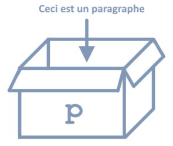
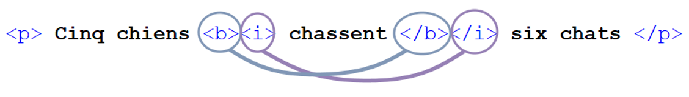
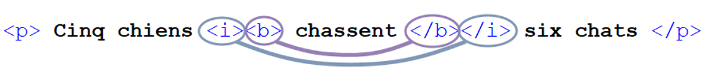
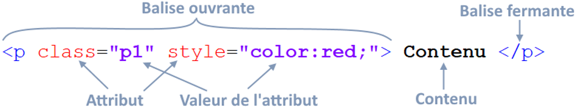

# Introduction à HTML

## 📋 Table des matières

1. [Qu'est-ce que HTML ?](#-quest-ce-que-html)
2. [Structure de base](#-structure-de-base)
3. [Composition d'un élément HTML](#-composition-dun-élément-html)
4. [Structure complète d'une page HTML](#-structure-complète-dune-page-html)
5. [Les commentaires](#-les-commentaires)
6. [Les caractères spéciaux](#-les-caractères-spéciaux)
7. [Éléments HTML de base](#-éléments-html-de-base)
8. [Navigation et liens](#-navigation-et-liens)
9. [Validation du code HTML](#-validation-du-code-html)

---

## 🌐 Qu'est-ce que HTML ?

### Définition

**HTML** = **H**yper**T**ext **M**arkup **L**anguage


HTML permet de décrire la **structure** d'une page Web :
- Texte
- Images
- Boutons
- Formulaires
- Vidéos
- Titres
- etc.

Cette structure peut être **interprétée et affichée** par un navigateur web :
- Internet Explorer
- Chrome
- Firefox
- Safari
- Edge
- etc.

---

## 🏗️ Structure de base

### Les balises HTML

Chaque élément HTML est représenté par des **balises**.

**Exemple :**
```html
<p> La balise p représente un paragraphe de texte. </p>
```

L'élément `p` correspond à un paragraphe.


**Résultats :**
<p> La balise p représente un paragraphe de texte. </p>
---

### ✅ Règles des balises

#### 1. Balises ouvrantes et fermantes

- L'élément commence par la **balise ouvrante** : `<p>`
- L'élément se termine par la **balise fermante** : `</p>`
- Une balise fermante nécessite toujours une **barre oblique** `/` suivie du nom de l'élément

---

#### 2. Analogie de la boîte 📦

Les balises ouvrantes et fermantes peuvent être vues comme une **boîte** dans laquelle on met notre élément.

```html
<p> Ceci est un paragraphe </p>
```



:::warning Attention

S'il manque la balise ouvrante ou fermante, il manque la moitié de la boîte... Et le résultat pourrait être décevant !

<Row>
<Column>

**Balise fermante manquante :**
```html
<p> Ceci est un paragraphe
```


</Column>
<Column>

**Balise ouvrante manquante :**
```html
Ceci est un paragraphe </p>
```


</Column>
</Row>

:::

---

### ⚠️ Exceptions aux balises fermantes

Il existe des exceptions pour les balises qui n'ont pas de contenu. Ces balises ne possèdent donc pas de balise fermante, mais uniquement une balise ouvrante. Elles sont également appelées **balises auto-fermantes**. 

Voici 2 exemples simples :

#### Élément `<br>` (Break / Saut de ligne)

- **Pas besoin de balise fermante**, ni de contenu !
- Insère un **saut de ligne** dans un paragraphe

#### Élément `` (Image)

- **Pas besoin de balise fermante**
- Nécessite des **attributs** pour choisir l'image à afficher

**Exemple :**
```html
<p> Coucou <br> Ça va ? </p>

```

**Résultats :**

:::info information
    Il y a plusieurs autres balises auto-fermantes (`<hr>`, `<input>`, `<meta>`, `<link>`, etc.)
:::
---

### 📦 Éléments imbriqués

Certains éléments peuvent **contenir d'autres éléments**.

**Exemple :**
```html
<body>
    <div>
        <p> La balise p représente un <b> paragraphe </b> de texte. </p>
    </div>
</body>
```

**Ici on a :**
- un **body** qui contient...
- un **div**, qui contient...
- un **p**, qui contient...
- du texte et un **b**, qui contient...
- du texte !

**Visualisation en boîtes imbriquées :**

```
┌─── body ────────────────────────────┐
│  ┌─── div ──────────────────────┐   │
│  │  ┌─── p ──────────────────┐  │   │
│  │  │  ┌─ b ─┐               │  │   │
│  │  │  │texte│      Du texte │  │   │
│  │  │  └─────┘               │  │   │
│  │  └────────────────────────┘  │   │
│  └──────────────────────────────┘   │
└─────────────────────────────────────┘
```


---

### ❌ Croiser des éléments est INTERDIT !

**🚫 Mauvais exemple :**
```html
<p> Cinq chiens <b><i> chassent </b></i> six chats </p>
```

Les balises `<b>` et `<i>` se **croisent**, ce qui est incorrect.



**✅ Bonne façon :**
```html
<p> Cinq chiens <i><b> chassent </b></i> six chats </p>
```

**Ou :**
```html
<p> Cinq chiens <b><i> chassent </i></b> six chats </p>
```



:::info information
    - L'élément `<b>` rend le texte en **gras**
- L'élément `<i>` met le texte en *italique*
:::
---

## 🔧 Composition d'un élément HTML

Un élément HTML est composé des segments suivants :



**Décomposition :**

| Segment | Exemple | Description |
|---------|---------|-------------|
| **Balise ouvrante** | `<p>` | Début de l'élément |
| **Attribut** | `class`, `style` | Propriétés de l'élément |
| **Valeur de l'attribut** | `"p1"`, `"color:red;"` | Valeurs assignées aux attributs |
| **Contenu** | `Contenu` | Texte ou éléments imbriqués |
| **Balise fermante** | `</p>` | Fin de l'élément |

---

### 📌 Règles importantes

✅ La valeur d'un **attribut** doit être encadrée avec des **guillemets**. Ils sont toujours situés dans la balise ouvrante... s'il y en a !

✅ Les attributs sont parfois **optionnels**.

✅ Tous les éléments ne contiennent **pas forcément un contenu**.

✅ Tous les éléments n'ont **pas forcément besoin d'une balise fermante**.

---

## 📄 Structure complète d'une page HTML

### Structure minimale

Une page HTML vide devrait au moins avoir la structure suivante :

```html
<!DOCTYPE html>
<html lang="fr">
    <head>
        <!-- Métadonnées -->
        <title>Page d'exemple</title>
        <meta charset="UTF-8">
        <meta name="viewport" content="width=device-width, initial-scale=1.0" />
    </head>

    <body>
        <!-- Contenu visible / Viewport -->
    </body>

</html>
```

---

### 📦 L'élément `<body>`

L'élément **body** contient **tous les éléments visibles** par l'utilisateur dans le corps de la page.

**Contenu typique :**
- Images
- Paragraphes
- Lecteur vidéo
- Formulaire
- Menu de navigation
- etc.

**Exemple :**
```html
<body>
    <!-- Contenu de la page visible pour l'utilisateur -->
</body>
```
:::info information
    Par exemple, body correspond véritablement à l'entièreté de la page dans le navigateur (**Encadré noir pointillé**).

    

:::

---

### 🧠 L'élément `<head>`

L'élément **head** permet de préciser des **métadonnées** de notre page HTML.

**Métadonnées courantes :**
- Titre de l'onglet (et titre dans les moteurs de recherche)
- Lien avec d'autres documents
- Auteur
- Description
- Famille de caractères
- Styles CSS
- etc.

**Exemple :**
```html
<head>
    <!-- Obligatoire -->
    <title>Page d'exemple</title>
    <meta charset="UTF-8">
    <meta name="viewport" content="width=device-width, initial-scale=1.0" />

    <!-- Optionnel -->
    <meta name="description" content="Description de mon site Web." />
    <meta name="keywords" content="html, css, banane, télécommande, pikachu" />
    <meta name="author" content="Carole Robidoux" />
</head>
```

---

### ✅ Trois éléments OBLIGATOIRES dans le `<head>`

#### 1. Élément `<title>`

Détermine le **titre** de la page Web. Cette information n'est qu'affichée dans le **nom de l'onglet** et dans les **moteurs de recherche**.

```html
<title>Page d'exemple</title>
```

**Affichage :** Le titre apparaît dans l'onglet du navigateur.

---

#### 2. Élément `<meta charset>`

Spécifie la **famille de caractères** utilisée par la page Web. On met toujours **UTF-8** ici.

```html
<meta charset="UTF-8">
```

---

#### 3. Élément `<meta>` (viewport)

Ajuste la **taille d'affichage** du site Web. Ci-dessous, on l'adapte à l'appareil (`width=device-width`) et on met le **zoom** par défaut à 100% (`initial-scale=1.0`).

```html
<meta name="viewport" content="width=device-width, initial-scale=1.0" />
```

---

### 🔖 Trois éléments OPTIONNELS (mais très utiles)

#### 1. Élément `<meta>` (description)

Spécifie la **description** du site. Elle apparaîtra généralement dans les moteurs de recherche.

```html
<meta name="description" content="Description de mon site Web." />
```

---

#### 2. Élément `<meta>` (keywords)

Spécifie les **« mots-clés »** du site Web. Aide les moteurs de recherche à référencer la page lorsque c'est pertinent. Il faut séparer les mots-clés par des **virgules**.

```html
<meta name="keywords" content="html, css, banane, télécommande, pikachu" />
```

---

#### 3. Élément `<meta>` (author)

Spécifie le ou les **auteur(s)** de la page Web.

```html
<meta name="author" content="Carole Robidoux" />
```

---

### 🏛️ Structure globale

Les éléments **head** et **body** sont englobés par l'élément **html**.

- L'élément **html** contient **TOUT** !
- ... Sauf la déclaration **`<!DOCTYPE html>`** à insérer au début de tout document HTML

```html
<!DOCTYPE html>
<html lang="fr">
    <head>
        <!-- Métadonnées -->
    </head>

    <body>
        <!-- Contenu visible -->
    </body>
</html>
```

Le **`<!DOCTYPE html>`** sert d'instruction au navigateur Web pour indiquer quelle version de HTML est utilisée.

---

## 💬 Les commentaires

Les commentaires HTML :
- Sont **ignorés** lors de l'affichage de la page Web
- Servent simplement d'**indice/description** pour les développeurs
- Prennent la forme suivante : `<!-- commentaire -->`

**Exemple :**
```html
<body>
    <!-- Syntaxe d'un commentaire -->
    <p> Paragraphe quelconque </p>
</body>
```
:::info information
    On peut les glisser à peu près n'importe où, tant que la syntaxe `<!-- ... -->` est respectée.
:::

:::warning Attention
    Les commentaires apparaitront dans le navigateur, si vous regardez le code source depuis l'**Outil de développeur** (Dev Tools).
:::

---

## 🔣 Les caractères spéciaux

### Entités de caractères

Certains caractères peuvent être affichés à l'aide de **« d'entités de caractères »**.

Ces entités de caractères ont la forme suivante : **`&...;`**

### Exemples courants

```html
<p>
    Copyright : &copy; <br>
    Espace : &nbsp; Bonjour<br>
    Trademark : &reg; <br>
    Abus d'espaces : &nbsp;&nbsp;&nbsp;&nbsp;
                     &nbsp;&nbsp;&nbsp;Bonjour
</p>
```

**Résultats :**
```
Copyright : ©
Espace :   Bonjour
Trademark : ®
Abus d'espaces :        Bonjour
```

### Pourquoi utiliser `&nbsp;` ?

Étant donné que les navigateurs ne prennent pas en compte les espaces ordinaires (ils les effacent pour n'en laisser que 1 seul), **`&nbsp;`** permet de mettre plusieurs espaces d'affilé.

📚 **Liste complète :** [https://dev.w3.org/html5/html-author/charref](https://dev.w3.org/html5/html-author/charref)

---

## 🧩 Éléments HTML de base

Abordons quelques éléments HTML de base :

- **p** : Paragraphe
- **br** : Saut de ligne
- **h1, h2, h3, h4, h5, h6** : Titres et sous-titres
- **strong** et **em** : Texte en gras (**strong**) et en italique (**em**)
- **ul, ol, li** : Listes
- **hr** : Ligne horizontale
- **div** : Conteneur générique / Division
- **img** : Images

---

### 📝 L'élément `<p>` (Paragraphe)

Permet d'insérer des paragraphes dans la page Web.

**Exemple :**
```html
<p>J'aime l'école.
C'est la plus belle chose au monde.</p>

<p>J'adore écouter un prof pendant des heures.</p>
```

**Résultats :**
<p>J'aime l'école. C'est la plus belle chose au monde.</p>

<p>J'adore écouter un prof pendant des heures.</p>

---

:::info information
    Un **saut de ligne automatique** est inséré à la fin de notre premier élément `<p>`.
:::

:::warning Attention
    Notez toutefois que le saut de ligne ajouté à la main après « école. » n'a aucun effet sur l'affichage de notre page Web !
:::

---

### ❤️ L'élément `<p>` rencontre l'élément `<br>`

Mais alors, comment insérer un saut de ligne à l'intérieur d'un paragraphe ? 🤔

C'est un match parfait : **br** permet d'insérer des sauts de ligne **manuellement** à l'intérieur d'un paragraphe !

**Exemple :**
```html
<p>J'aime l'école.<br>C'est la plus <br> belle <br> chose au monde.</p>

<p>J'adore écouter un prof pendant des heures.</p>
```

**Résultats :**
<p>J'aime l'école.</p>
<p>C'est la plus </p>
<p>belle</p>
<p>chose au monde.</p>
<p>J'adore écouter un prof pendant des heures.</p>

:::info information
    Remarquons que l'élément br n'a ni contenu, ni balise fermante.
:::

---

### 📐 Les éléments h1, h2, h3, h4, h5, h6

Utilisés pour insérer des **titres** ou des **sous-titres**.

**Exemple :**
```html
<h1>Titre de niveau 1</h1>
<h2>Titre de niveau 2</h2>
<h3>Titre de niveau 3</h3>
<h4>Titre de niveau 4</h4>
<h5>Titre de niveau 5</h5>
<h6>Titre de niveau 6</h6>
<p>Paragraphe ordinaire avec l'élément p</p>
```

**Résultats :**
<h1>Titre de niveau 1</h1>
<h2>Titre de niveau 2</h2>
<h3>Titre de niveau 3</h3>
<h4>Titre de niveau 4</h4>
<h5>Titre de niveau 5</h5>
<h6>Titre de niveau 6</h6>
<p>Paragraphe ordinaire avec l'élément p</p>


:::info information
    Remarquez que les éléments h4, h5 et h6 sont plus petits ou semblables à un paragraphe ordinaire !
:::
---

### 💪 Les éléments `<strong>` et `<em>`

- Encadrer du texte avec **strong** le rend **gras**.
- Encadrer du texte avec **em** le met en *italique*.

**Exemple :**
```html
<p>
    Texte en <strong>gras</strong>,
    en <em>italique</em>,
    ou <strong><em>les deux</em></strong>.
</p>
```

**Résultats :**
<p>
    Texte en <strong>gras</strong>,
    en <em>italique</em>,
    ou <strong><em>les deux</em></strong>.
</p>

:::info information
    - On remarque que ces éléments sont glissés à l'intérieur d'un paragraphe (d'un élément `<p>`), directement dans le texte.
    - On peut les insérer dans **plusieurs autres éléments** qui contiennent du texte !
:::

---

### 📋 Les éléments `<ul>`, `<ol>` et `<li>`

Permettent d'insérer des listes à **puces** (`<ul>`) ou **numérotées** (`<ol>`).

#### Liste à puces

```html
<!-- Liste à puces -->
<ul>
    <li>Un élément</li>
    <li>Un autre...</li>
    <li>Un dernier !</li>
</ul>
```

#### Liste numérotée

```html
<!-- Liste numérotée -->
<ol>
    <li>Premier élément</li>
    <li>Deuxième élément</li>
    <li>Troisième élément</li>
</ol>
```

**Résultats :**
<ul>
    <li>Un élément</li>
    <li>Un autre...</li>
    <li>Un dernier !</li>
</ul>
<ol>
    <li>Premier élément</li>
    <li>Deuxième élément</li>
    <li>Troisième élément</li>
</ol>

:::info information
- **`<li>`** représente chaque élément d'une liste
- **`<ul>`** et **`<ol>`** encadrent la liste et déterminent si c'est une liste **numérotée (`<ol>`)** ou **non (`<ul>`)**
:::

### 📚 Listes à plusieurs niveaux

Les listes peuvent avoir **plusieurs niveaux** !

Il suffit d'insérer une autre liste dans un élément `<li>`.

**Exemple :**
```html
<!-- Liste à 2 niveaux -->
<ul>
    <li>Banane</li>
    <li>Pomme
        <ol>
            <li>Granny Smith</li>
            <li>Mcintosh</li>
        </ol>
    </li>
    <li>Cerise</li>
</ul>
```

**Résultats :**
- Banane
- Pomme
  1. Granny Smith
  2. Mcintosh
- Cerise

:::info information
Ici, on remarque qu'après « pomme », on n'a pas `</li>` directement puisqu'il est situé tout de suite après la sous-liste.
:::

---

### 📏 L'élément `<hr>` (Horizontal Rule)

Insère une **ligne horizontale** dans la page Web.

**Exemple :**
```html
<p>Première section de la page.</p>
<hr>
<p>Deuxième section de la page.</p>
```

**Résultats :**

Première section de la page.

---

Deuxième section de la page.


:::info information
Cette ligne prendra toute la largeur disponible.
:::

---

### 📦 L'élément `<div>` (Division / Conteneur)

L'élément **div** est un **conteneur générique** qui permet de regrouper d'autres éléments HTML.

**Caractéristiques :**
- Ne produit **aucun effet visuel** par défaut
- Sert à **organiser et structurer** le contenu
- Très utile pour appliquer des **styles CSS** à un groupe d'éléments
- Crée un **bloc** (prend toute la largeur disponible)

**Exemple :**
```html
<div>
    <h2>Section À propos</h2>
    <p>Voici des informations sur notre entreprise.</p>
    
</div>

<div>
    <h2>Section Contact</h2>
    <p>Contactez-nous à contact@exemple.com</p>
</div>
```

**Visualisation d'un  `<div>`:**

```
┌─────────────────────────────────────┐
│ Section À propos                    │ ← Premier div
│ Voici des informations sur notre    │
│ entreprise.                         │
│ [Image du logo]                     │
└─────────────────────────────────────┘

┌─────────────────────────────────────┐
│ Section Contact                     │ ← Deuxième div
│ Contactez-nous à contact@exemple.com│
└─────────────────────────────────────┘
```
:::info  Pourquoi utiliser `<div>`
- **Organisation** : Regrouper des éléments liés ensemble
- **Styling CSS** : Appliquer un style à un groupe d'éléments
- **Structure de page** : Créer des sections (header, footer, sidebar, etc.)
- **Manipulation JavaScript** : Cibler un groupe d'éléments
:::

:::warning Attention
    - Le `<div>` est un élément **générique** sans signification sémantique
- Pour une meilleure sémantique HTML5, préférez des éléments comme `<header>`, `<footer>`, `<section>`, `<article>`, `<nav>` quand approprié
- Ne pas abuser des `<div>` : utilisez l'élément le plus approprié pour votre contenu
:::

**Exemple avec attributs (pour plus tard avec CSS) :**
```html
<div class="card">
    <h3>Titre de la carte</h3>
    <p>Contenu de la carte</p>
</div>
```
**Le `<div>` deviendra votre meilleur ami quand vous commencerez à utiliser CSS !**

---

## 🖼️ Les images

### L'élément ``

Permet d'insérer une image dans notre page Web.

**Exemple :**
```html

```

### Attributs importants

#### Attribut `src` (source)

**Où trouver l'image ?**

Ça peut être :
- Sur un autre site Web
- Dans un dossier voisin du dossier qui contient votre page Web

#### Attribut `alt` (texte alternatif)

**Si l'image ne peut pas être affichée, la valeur de alt est le texte qui la remplacera** (Obligatoire !)

Ça peut également servir à des fins d'accessibilité.

---

### 📁 Comment trouver la valeur de l'attribut `src` ?

Il existe plusieurs cas de figure selon l'emplacement de l'image.

---

#### Cas 1 : Image dans le même dossier

**Le plus simple :** Tel que ci-dessus, notre page Web est dans le même dossier que l'image.

**Très simple :** La valeur de l'attribut `src` sera simplement le nom du fichier image !

Dans ce cas, on aura :

```html

```


Cela correspond à un **« lien relatif »**.

---

#### Cas 2 : Image dans un sous-dossier

**Cas suivant :** L'image est située dans un sous-dossier du dossier qui contient la page Web.

On devra préciser le chemin vers ce sous-dossier suivi d'une barre oblique dans la valeur de l'attribut. Disons que notre image « ehh.png » est située dans le dossier **images**, on devra mettre :

```html

```


---

#### Cas 3 : Image dans un dossier parent

**Autre cas :** L'image est située dans un dossier **parent** du dossier qui contient la page Web.

On devra mettre `../` avant le nom de notre fichier image. Ces deux points signifient qu'on retourne au dossier **parent** du dossier actuel.

```html

```


---

#### Cas 4 : Combinaison des chemins

**Pire cas :** Combinaison des cas précédents. L'image est dans le dossier enfant d'un dossier arrière-grand-parent du dossier qui contient la page Web...

On devra utiliser une combinaison des deux méthodes précédentes !

```html

```


**Explication :**
- On est donc revenu dans le dossier parent 3 fois d'affilée (../)
- Puis on est allé dans le sous-dossier **images**

---

#### Cas 5 : Image externe (URL absolue)

**Image externe (sur un autre site Web) :** Mettez simplement l'URL en entier vers cet image.

:::warning Attention aux droits d'auteur !
⚖️ Assurez-vous d'avoir le droit d'utiliser l'image.
:::

```html

```


Cela correspond à un **« lien absolu »**.

---

## 🔗 Navigation et liens

### Introduction

On est maintenant capable de faire **une** page Web simple et de la peupler.

**Un site Web est constitué de plusieurs pages Web**, cela dit...

**Comment faire pour avoir 2 pages reliées ?**

On aimerait que les mots « **Accueil** » et « **À propos** » dans le haut des pages soient cliquables et permettent de changer de page Web !


---

### L'élément `<a>` (Ancre / Lien)

Permet de rendre un élément (texte, image, bouton, etc.) **cliquable** !

Mène vers :
- Une autre page Web
- Un site externe
- Un document à télécharger
- etc.

**Fonctionnement :**

```html
<a href="url relatif ou absolu"> Élément cliquable </a>
```


---

### Exemple : Lien entre deux pages

**Dans ce cas-ci, nos pages « apropos.html » et « accueil.html » sont dans le même dossier :**

**Page Accueil :**
```html
<a href="apropos.html">À propos</a>
```

**Page À propos :**
```html
<a href="accueil.html">Accueil</a>
```


**Comme pour une image, il suffit d'utiliser un lien relatif pour que l'élément `<a>` nous amène vers l'autre page.**

---

### Navigation avec chemins relatifs

#### Lien vers une page dans le même dossier

Le texte « **À propos** » est entouré d'un élément `<a>` qui mène vers la page **apropos.html**.

```html
<a href="apropos.html">À propos</a>
```

**Le texte cliquable deviendra par défaut bleu (ou violet si vous avez déjà visité la page visitable).**

---

#### Lien vers une page dans un dossier parent

Le texte « **Accueil** » est entouré d'un élément `<a>` qui mène vers la page **accueil.html** située dans le dossier parent.

```html
<a href="../accueil.html">Accueil</a>
```


---

### Lien vers un site externe

**Lien vers un site Web externe :**

```html
<a href="https://fr.wikipedia.org/wiki/Chaise">Visitez ce site Web pour plus d'info sur les chaises.</a>
```


**Résultats :**

[Visitez ce site Web pour plus d'info sur les chaises.](https://fr.wikipedia.org/wiki/Chaise)

---

### Lien vers un document

**Lien vers un document situé dans le même dossier que la page Web (lance le téléchargement du document) :**

```html
<a href="accueil_imagetest.docx">Téléchargez ce document pour voir plus longtemps.</a>
```

---

## ✅ Validation du code HTML

### Qu'est-ce que la validation ?

**Valider** son code HTML = Vérifier qu'il n'y a aucune erreur de syntaxe.

**Très important !**

Votre page ou des éléments pourraient mal s'afficher.


---

### Accessibilité

**Accessibilité :** Concept qui facilite l'accès au contenu Web pour des gens avec des handicaps variés.

**Exemple concret :** Utilisateur aveugle qui utilise un « Lecteur de page Web » qui verbalise le contenu de la page.

Si vous faites des erreurs de syntaxe, ce genre d'outil se met à très mal fonctionner et l'utilisateur ne pourra pas profiter de votre contenu.

---

### Comment valider ?

Grâce à l'outil : **[https://validator.w3.org/](https://validator.w3.org/)**

**Étapes :**
1. Choisissez l'onglet "Validate by File Upload"
2. Trouvez votre fichier .html
3. Vérifiez la validité !


**Outil W3C Markup Validation Service** :
- Validate by URI
- Validate by File Upload
- Validate by Direct Input

---

### Exemple de validation

**Cette page Web est-elle valide ?**

```html
<!DOCTYPE html>
<html>
<head>
    <title>Page d'exemple</title>
</head>

<body>
    <h1>Titre de la page</h1>
    
    <p>Petit paragraphe
    <strong>em>inoffeensif.</strong></em></p>
</body>

</html>
```


**Oulala... il y a quelques erreurs !**

Le validateur W3C détecte :
- Missing attribute `lang`
- Missing attribute `charset`
- End tag `h2` seen but there were open elements
- `Strong` element still open
- etc.

---