# Introduction à CSS

## 📋 Table des matières

1. [Qu'est-ce que CSS ?](#-quest-ce-que-css)
2. [Syntaxe de CSS](#-syntaxe-de-css)
3. [Méthodes d'application du CSS](#-méthodes-dapplication-du-css)
    1. [CSS Intraligne](#méthode-1--css-intraligne) (dans la balise ouvrante avec `style="..."`)
    2. [CSS Interne](#méthode-2--css-interne) (dans le `<head>` avec `<style>`)
        1. [Sélecteur de type Balise](#type-1-de-sélecteur--sélecteur-élément)
        2. [Sélecteur de type Classe](#type-2-de-sélecteur--sélecteur-classe)
        3. [Sélecteur de type Id](#type-3-de-sélecteur--sélecteur-id)
    3. **[CSS Externe](#méthode-3--css-externe)** (fichier `.css` séparé) **← Recommandé**
7. [Éléments de groupement](#-éléments-de-groupement)
    1. [Div](#élément-div)
    2. [Span](#élément-span)
8. [Éléments sémantiques HTML5](#-éléments-sémantiques-html5)
    1. [Header](#élément-header)
    2. [Nav](#élément-nav)
    3. [Main](#élément-main)
    4. [Footer](#élément-footer)
9. [Styles de base](#-styles-de-base)
    1. [Couleurs](#-couleurs)
    2. [Texte](#-texte)
    3. [Police de caractères](#-police-de-caractères)

---

## 🎨 Qu'est-ce que CSS ?

### Introduction à CSS

**CSS** = **C**ascading **S**tyle **S**heet (Feuille de style en cascade)


---

### Définition

CSS permet de décrire **comment les éléments HTML doivent être affichés** :
- **Couleur** du texte et des arrière-plans
- **Taille** des éléments
- **Bordures** et contours
- **Position** des éléments
- **Polices** de caractères
- etc.

---

:::info information

- **Économie de temps et de code**

        Peut décrire l'affichage de plusieurs pages à la fois ! (Économie de temps et de code)

- **Séparation du contenu et du style**

        Le HTML s'occupe de la structure, le CSS s'occupe de l'apparence.

- **Fonctionne avec des sélecteurs et des règles**

        Les **sélecteurs** permettent de cibler les éléments HTML, et les **règles** définissent leur style.

:::
---

### Exemple simple

Voici un petit morceau de CSS qui change le style de notre paragraphe :

```html
<p style="color:violet;">Petit paragraphe de couleur violette.</p>
```

**Résultats :**

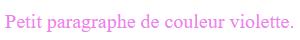

`color:violet;` est un petit morceau de CSS qui change le style de notre paragraphe.

---

## 📝 Syntaxe de CSS

### Structure d'une règle CSS

Chaque modification appliquée à un élément est représentée par une **règle**.

Une règle est composée d'un **attribut** et d'une **valeur** :

```css
attribut: valeur;
```

**Quelques exemples :**

```css                      
                            /* Commentaires */
color: blue;                /* Transforme la couleur du texte en bleu */
border: solid black 3px;    /* Ajoute une bordure pleine, noir de 3px de large */
text-decoration: none;      /* Enlève la décoration d'un élément html (ex. le sous-lignement d'un lien) */
font-weight: bold;          /* Transforme le texte en gras*/

```

:::info information
    - Deux points séparent l'**attribut** et sa **valeur**
    - Un point-virgule conclut la règle
:::

---

## 🔧 Méthodes d'application du CSS

Il existe **3 méthodes** d'appliquer une règle CSS :

1. [CSS Intraligne](#méthode-1--css-intraligne) (dans la balise ouvrante avec `style="..."`)
2. [CSS Interne](#méthode-2--css-interne) (dans le `<head>` avec `<style>`)
    1. [Sélecteur de type Balise](#type-1-de-sélecteur--sélecteur-élément)
    2. [Sélecteur de type Classe](#type-2-de-sélecteur--sélecteur-classe)
    3. [Sélecteur de type Id](#type-3-de-sélecteur--sélecteur-id)
3. **[CSS Externe](#méthode-3--css-externe)** (fichier `.css` séparé) **← Recommandé**

---

### Méthode #1 : CSS Intraligne

On glisse les règles CSS dans l'attribut **style** d'une balise ouvrante.

Comme pour tout attribut, les règles CSS devront être entourées de guillemets.

**Exemple :**

```html
<a style="background-color: #BB2649;" href="https://www.w3schools.com/colors/colors_trends.asp">2023 - Viva Magenta</a>
```


**Résultats :**


---

### Méthode #2 : CSS Interne

Pour comprendre cette deuxième méthode, nous devons d'abord étudier les **sélecteurs CSS**.

Un **sélecteur** permet d'indiquer à quel(s) élément(s) HTML des règles CSS doivent être appliquées.

Voici la syntaxe à respecter pour le CSS interne :

```css
sélecteur {
    attribut: valeur;
    attribut: valeur;
    attribut: valeur;
}
```

Il existe plusieurs types de sélecteurs CSS. Voici les 3 principaux :

1. [Sélecteur de type Balise](#type-1-de-sélecteur--sélecteur-élément) (p, h1, div, etc.)
2. [Sélecteur de type Classe](#type-2-de-sélecteur--sélecteur-classe) (.nom_classe)
3. [Sélecteur de type Id](#type-3-de-sélecteur--sélecteur-id) (#nom_id)

---

#### Type 1 de sélecteur : Sélecteur élément

Ce type de sélecteur correspond exactement au nom de l'élément HTML auquel le CSS sera appliqué.

**Pour appliquer un style** (un ensemble de règles CSS) à toutes les balises `<p>`, le sélecteur sera **p**.

**Pour appliquer un style** à toutes les balises `<h1>`, le sélecteur sera **h1**.

**Exemple :**

```css
p {
    color: blue;
}

h1 {
    font-size: large;
    font-weight: bold;
}
```

---

##### Où insère-t-on le CSS interne avec les sélecteurs ?

Dans la balise `<head>`, avec une balise qu'on nomme `<style>` :

```html
<head>
    <meta charset="UTF-8">
    <meta name="viewport" content="width=device-width, initial-scale=1.0" />
    <title>Page d'exemple</title>
    <style>
        p {
            color: blue;
            font-size: large;
            font-weight: bold;
        }
    </style>
</head>

<body>
    <h1>Titre de la page</h1>
    <p>Paragraphe en bleu.</p>
</body>
```

**Résultats :**

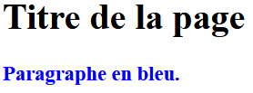
---

#### Type 2 de sélecteur : Sélecteur classe

Ce type de sélecteur peut avoir n'importe quel nom, mais il doit être appliqué aux éléments concernés grâce à l'attribut **class**.

**Exemple :**

```html
<p class="ma_classe">Paragraphe en violet.</p>
```

```css
.ma_classe {
    color: rebeccapurple;
}
```

**Résultats :**

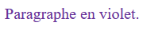

:::warning Attention
Remarquez que ce sélecteur **DOIT** être précédé d'un point.

```css
p {
    color: red;             /*Applique une couleur à tous les balises de p*/
}

.p {                        /*Applique une couleur à tous les classes p*/
    color: rebeccapurple;
}
```

On peut appliquer cette classe à autant d'éléments qu'on le souhaite !

:::

---

#### Type 3 de sélecteur : Sélecteur id

Ce type de sélecteur peut avoir n'importe quel nom, mais il doit être appliqué à l'élément concerné grâce à l'attribut **id**.

**Exemple :**

```html
<p id="mon_id">Paragraphe en jaune.</p>
```

```css
#mon_id {
    color: goldenrod;
}
```

**Résultats :**

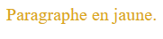

:::warning Attention
Remarquez que ce sélecteur **DOIT** être précédé d'un dièse.

**La différence avec une classe :** On ne peut l'appliquer qu'à **un seul élément** par page Web !
:::

:::info information
Un élément HTML peut avoir plusieurs **classes** et un seul **id**.

```html
<p class="classe-paragraphe classe-main classe-importante" id="id-p-jaune">
    Paragraphe en jaune.
</p>
```

Cette exemple possède 3 classes :
1. ```classe-paragraphe```
2. ```classe-main```
3. ```classe-importante```

et son id ```id-p-jaune```.
:::

---

### Méthode #3 : CSS Externe

Cette méthode permet de directement inserer le **CSS** dans **un autre fichier**.

C'est un fichier avec l'extension **.css**

On y glisse nos sélecteurs et nos règles CSS comme dans le `<head>`, mais on doit insérer une ligne supplémentaire au tout début :

```css
@charset "UTF-8";
```

**Cette ligne sert simplement à indiquer la famille de caractères du fichier CSS.**

---

#### Lier le fichier CSS à la page HTML

Par contre, ce fichier doit être « associé » à notre page Web pour fonctionner.

On utilise pour ça l'élément **link** dans le `<head>` :

```html
<head>
    <meta charset="UTF-8">
    <title>Page d'exemple</title>
    <link rel="stylesheet" href="styles.css">
</head>
```

**Ce lien relatif vers notre fichier CSS externe** fonctionne comme les éléments **img** et les éléments **a** !

Cet attribut permet de spécifier le type de relation avec le fichier associé. Dans ce cas-ci, c'est une feuille de styles.

---

## 🤔 Quelle manière faut-il privilégier ?

### Les 3 méthodes comparées

**CSS externe** (fichier séparé) : **À privilégier !** 
- Cela permet de réunir le CSS de plusieurs pages Web dans un seul fichier et cela encourage à uniformiser les styles d'un site Web avec plusieurs pages.

**CSS interne** (dans le `<head>`) : **À éviter**, mais parfois pratique
- Si une page Web se distingue fortement des autres en raison d'un événement particulier... Cela évite de mettre du CSS qui ne servira qu'à une seule page dans un fichier commun.

**CSS intraligne** (dans la balise concernée avec `style="..."`) : **À éviter !**
- Si un élément est très particulier et a besoin d'une règle unique, le CSS Intraligne dépanne... mais il faut tenter de trouver une solution plus globale si possible.

:::info Information
Dans le cadre du cours, nous utiliserons les trois manières à des fins pédagogiques.
:::

---

## 📦 Éléments de groupement

### Introduction

Disons qu'on souhaite appliquer un style à quelques paragraphes précis, il faut trouver une façon de selectionner plusieurs parapgraphes simultannément !

**Sans élément de groupement :**

```html
<h1>Titre de la page</h1>

<p>Un premier paragraphe.</p>
<p>Un deuxième paragraphe.</p>
<p class="blue">Un troisième paragraphe.</p>
<p class="blue">Un quatrième paragraphe.</p>
<p class="blue">Un deuxième paragraphe.</p>
<p>Un sixième paragraphe.</p>
```

```css
    .blue {
        color: blue;
    }
```

**Résultats :**

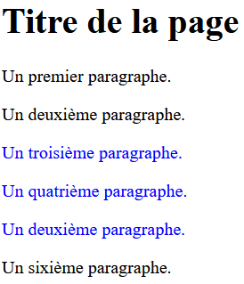

---

### Élément `<div>`

L'élément **div** permet (entre autre) d'appliquer un style à plusieurs balises simultanément.

**Exemple :**

```html
<h1>Titre de la page</h1>

<p>Un premier paragraphe.</p>
<p>Un deuxième paragraphe.</p>
<div class="blue">
    <p>Un troisième paragraphe.</p>
    <p>Un quatrième paragraphe.</p>
    <p>Un cinquième paragraphe.</p>
</div>
<p>Un sixième paragraphe.</p>
```

**Résultats :**


:::info Information
Vous pouvez voir qu'il n'y a aucune différence dans le Résultats de la page. Il n'est donc pas nécéssaire de définir une classe à chaque élément p.
:::

---

### Élément `<span>`

L'élément **span** est similaire à div... mais pour une **portion de texte** !

**Exemple :**

```html
<p>J'aimerais que seul le mot <span class="rouge">span</span> soit coloré.</p>
```

```css
    .rouge {
        color: red;
    }
```

**Résultats :**

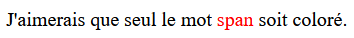 

---
## 📦 Éléments sémantiques HTML5

### Élément `<header>`

**En-tête de la page**. Souvent commun à toutes les pages d'un site Web. Contient titres, bannières, logos, etc.

Encadré en rouge ici :

```html
<header>
    <!-- Contenu du header -->
</header>
```

**Exemple visuel :**
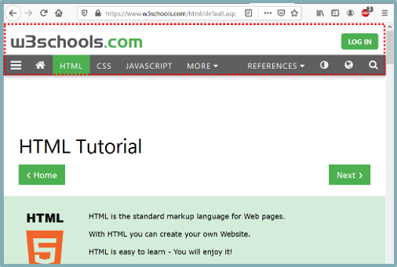

---

### Élément `<nav>`

Contient le **menu de navigation** (généralement avec des boutons) vers les autres pages principales du site Web.

Parfois intégré à l'intérieur du **header**, parfois non.

Parfois horizontal, parfois vertical.

Encadré en rouge dans l'extrait ci-contre :

Il peut y en avoir plusieurs dans une page.

```html
<nav>
    <!-- Contenu du nav -->
</nav>
```

**Exemple visuel :**
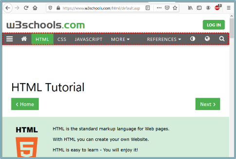

---

### Élément `<main>`

Contenu qui varie grandement d'une page à l'autre.

C'est toutes les informations propres à **une page** et non au site au complet.

Potentiellement très vaste.

Encadré en rouge ici :

```html
<main>
    <!-- Contenu du main -->
</main>
```

**Exemple visuel :**
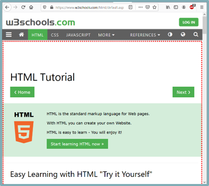

---

### Élément `<footer>`

**Pied de page**, souvent commun à toutes les pages d'un site Web. Contient logo, copyrights, « à propos », etc.

Encadré en rouge ici :

```html
<footer>
    <!-- Contenu du footer -->
</footer>
```

**Exemple visuel :**
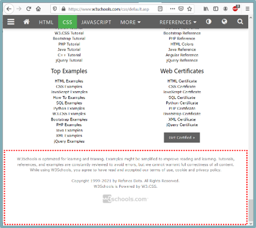

---

### Exemple complet

Voici un exemple complet de la stucture 

```html
<!DOCTYPE html>
<html lang="fr">
    <head>
        <!-- Métadonnées -->
        <title>Page d'exemple</title>
        <meta charset="UTF-8">
        <meta name="viewport" content="width=device-width, initial-scale=1.0" />
    </head>

    <body>

       <header>
            <!-- Contenu du header -->

             <nav>
                <!-- Contenu du nav -->
            </nav>
        </header>

        <main>
            <!-- Contenu du main -->
        </main>

        <footer>
            <!-- Contenu du footer -->
        </footer>

    </body>

</html>
```

### Éléments sémantiques vs div/span

Il existe d'autres éléments de groupement, comme **div** et **span**... mais ils sont **sémantiques**.

Les éléments **div** et **span** ne sont pas sémantiques : Ils sont **utilitaires / pratiques**, ils nous permettent de grouper du texte ou des éléments.

Les éléments **header**, **nav**, **main** et **footer** sont sémantiques : Ils donnent une signification aux éléments qu'ils regroupent et ne devrait être utilisés qu'une fois par page Web chacun. (Sauf nav)

**En terme d'utilité, ils sont similaires à div :** Ils regroupent des éléments.

**Cependant**, les balises sémentiques offrent des avantages au niveau de l'accessibilité (Accès au contenu pour les utilisateurs avec handicap) .

:::warning Attention
En terme d'utilité, ils sont similaires à **div** : Ils regroupent des éléments.
:::

---

## 🌈 Styles de base

Pour conclure, abordons quelques styles CSS de base :

1. [Styles pour les couleurs](#-couleurs)
2. [Styles pour le texte](#-texte)
3. [Styles pour la  police de caractères](#-police-de-caractères)

Pour les curieux / étudiants qui ne dorment pas :

Liste de tous les styles CSS : **https://www.w3schools.com/cssref/**

---

### 🎨 Couleurs

#### Règle `color`

Change la **couleur du texte**.

```html
    <div style="color: #F5DF4D;">
        <p>2021 - Illuminating</p>
        <p>Hex #F5DF4D</p>
        <p>PANTONE 13-0647</p>
        <p>https://www.w3schools.com/colors/colors_trends.asp</p>
    </div>
```


**Résultats :**


---

#### Règle `background-color`

Change la **couleur de fond** d'un élément.

```html
<h2>Le CSS c'est trépidant.</h2>

    <div style="background-color: #88B04B;">
        <p>2017 Greenery</p>
        <p>Hex #88B04B</p>
        <p>Pantone 15-0343</p>
        <p>https://www.w3schools.com/colors/colors_trends.asp</p>
    </div>
```

**Résultats :**

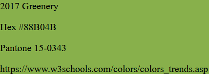

---

#### Règle `border`

Encadre un élément / du texte avec une bordure.

**Syntaxe :**

```
border: [style] [couleur] [largeur];
```

1. **Types de bordure (style) ← Obligatoire :** Elle est **continue** (solid) ou elle **n'est pas continue** (dashed, dotted, double...)

2. **Couleur de la bordure:** Il s'agit de la couleur de la bordure, définie comme pour la couleur de texte ou le fond.

3. **Largeur de la bordure:** Elle sera mesurée en pixels (`px`).

```html
<div>
    <p>2013 Emerald</p>
    <p style="border: 4px solid #009B77;" >Hex #009B77</p>
    <p>Pantone 17-5641</p>
    <p>https://www.w3schools.com/colors/colors_trends.asp</p>
</div>
```

**Résultats :**

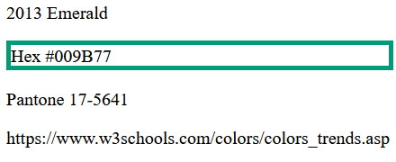


:::info Information 

`border` est une propriété abrégée permettant de définir la largeur, le style et la couleur de la bordure. Comme bien d'autres propriétés css, une propriété abrégée permet de définir plusieurs propriétés en une seule ligne.

:::
:::info Information 

Une propriété abrégée possède des propriété obligatoires et optionnels. De plus, il n'y a pas d'ordre des propriétés. Ainsi, les deux codes `ccs` suivants sont équivalents :

```css
border: 4px solid #009B77;
```

```css
border: solid #009B77 4px;
```

:::
---

#### Comment choisir une couleur PRÉCISE ?

- Utiliser un des **140 noms de couleurs** que CSS connaît... (blue, red, yellow, green, rebeccapurple, saddlebrown, peru, etc.) [https://www.w3schools.com/cssref/css_colors.php](https://www.w3schools.com/cssref/css_colors.php).

- Utiliser le **code hexadécimal** d'une couleur précise :

```css
.special {
    color: #e05eb2;
}
```

- Ou utiliser l'outil de sélection de couleur de Visual Studio Code en cliquant sur la case de couleur.

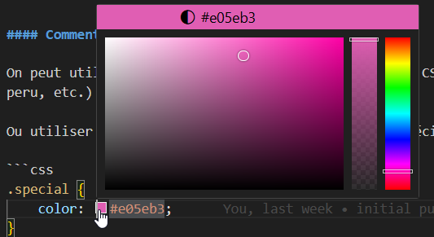

:::info Information
- **Pipette à couleurs en ligne :**
[https://htmlcolorcodes.com/color-picker/](https://htmlcolorcodes.com/color-picker/)

- **Extension de navigateur pour selectionner une couleur depuis un site web:**
    - **Chrome :** [https://chromewebstore.google.com/detail/colorzilla/bhlhnicpbhignbdhedgjhgdocnmhomnp](https://chromewebstore.google.com/detail/colorzilla/bhlhnicpbhignbdhedgjhgdocnmhomnp)
    - **Firefox :** [https://addons.mozilla.org/en-CA/firefox/addon/colorzilla/](https://addons.mozilla.org/en-CA/firefox/addon/colorzilla/)


- **Logiciel pour avoir une pipette à couleur directement dans Windows:**
[https://learn.microsoft.com/en-us/windows/powertoys/color-picker](https://learn.microsoft.com/en-us/windows/powertoys/color-picker)
**
:::

---

### ✍️ Texte

#### Règle `text-align`

Change **l'alignement horizontal** d'un texte. (Options : left, center, right, justify)

```html
<p style="text-align:left;">Ce texte est aligné par défaut.</p>
<p style="text-align:right;">Ce texte est aligné à droite.</p>
<p style="text-align:center;">Ce texte est aligné au centre.</p>
```

**Résultats :**

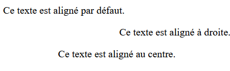

---

#### Règle `text-decoration`

Permet de mettre un trait sur / à travers / sous le texte. (Options : underline, overline, line-through, none)

```html
<p>Ce texte n'a pas de trait.</p>
<p style="text-decoration:underline;">Ce texte est souligné.</p>
<p style="text-decoration:line-through;">Ce texte est rayé.</p>
```

**Résultats :**

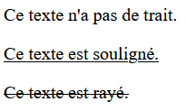

---

#### Règle `text-transform`

Détermine si le texte est en majuscules / minuscules. (Options : lowercase, uppercase, capitalize)

```html
<p style="text-transform:uppercase;">Ce texte est en majuscules.</p>
<p style="text-transform:lowercase;">Ce TEXTE SERA EN MINUSCULES.</p>
<p style="text-transform:capitalize;">Ce Texte Sera Similaire À Un Titre En Anglais.</p>
```


**Résultats :**

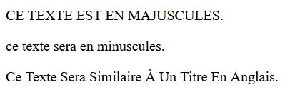

---

### 🔤 Police de caractères

#### Règle `font-family`

Détermine la **famille de police** du texte (Les options sont TRÈS nombreuses : Times New Roman, Verdana, Calibri, Courrier New, etc.)

```html
<p style="font-family:Verdana;">Ce texte est en Verdana.</p>
<p style="font-family:'Times New Roman';">Ce texte est en Times New Roman.</p>
<p style="font-family:'Lucida Handwriting';">Ce texte est en Lucida Handwriting</p>
<p style="font-family:Verdana,'Times New Roman';">Ce texte est en Times New Roman uniquement si Verdana n'est pas disponible.</p>
```
**Résultats :**

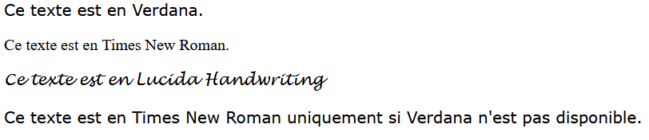

---

Il existe plusieurs type de polices, voici les cinq grandes familles :

1. Les polices à empattement (**Serif**) possèdent un petit trait à l'extrémité de chaque lettre. Elles confèrent une impression de formalité et d'élégance.
2. Les polices sans empattement (**Sans Serif**) ont des lignes épurées (sans petits traits). Elles créent un style moderne et minimaliste.
3. Les polices à chasse fixe (**Monospace**) sont composées de lettres de même largeur. Elles donnent un aspect mécanique.

Les deux familles suivantes sont moins souvent utilisées dans le cadre d'un site web et relève plutot de cas particuliés.
4. Les polices **Cursives** imitent l'écriture manuscrite.
5. Les polices **Fantaisie** sont des polices décoratives et ludiques.


:::info Information
**On peut ordonner plusieurs polices en les séparant par des virgules.** Si jamais la première police n'est pas disponible dans le navigateur, la suivante sera utilisée.
:::

:::warning Attention
Une police qui doit être écrite en plusieurs mots doit **être encadrée avec des apostrophes**.
:::

:::info Information

:::

---

#### Règle `font-style`

Règle qui détermine « **à quel point une police est penchée / italique** ».

(Options : normal, italic, oblique)

```html
<p style="font-style:normal;">Les lettres sont stables.</p>
<p style="font-style:italic;">Les lettres font comme Michael Jackson.</p>
<p style="font-style:oblique;">Les lettres ont peur de tomber.</p>
```

**Résultats :**

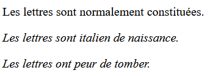

---

#### Règle `font-size`

Détermine la **taille du texte**. Calculé en **pixels** ou en **em**. 1 em = taille ordinaire, 2 em = double de la taille ordinaire.

```html
<p style="font-size:1em;">Texte de taille ordinaire.</p>
<p style="font-size:2em;">Texte deux fois plus grand.</p>
<p style="font-size:200px;">Texte un peu grand.</p>
```
**Résultats :**

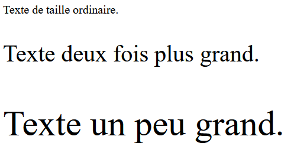


:::info Information
**Pour voir tous les unités de mesure utilisable en css**, [w3schools explique très bien chacune des unités de mesure permises](https://www.w3schools.com/cssref/css_units.php)
:::
---

### Règle `font-weight`

Détermine l'**épaisseur** du texte. (Options : normal, bold, bolder, lighter, ou un nombre entre 100 et 900)

```html
<p style="font-weight:normal;">Texte normal.</p>
<p style="font-weight:bold;">Texte en gras.</p>
<p style="font-weight:900;">Texte très gras.</p>
```

**Résultats :**

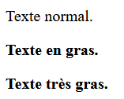

---

### Règle `line-height`

Détermine la **hauteur de ligne** d'un texte. Cela affecte l'espacement entre les lignes.

```html
<p style="line-height:1.5;">Texte avec un espacement de ligne de 1.5.</p>
<p style="line-height:2;">Texte avec un espacement de ligne de 2.</p>
<p style="line-height:5;">Texte avec un espacement de ligne de 5.</p>
```

**Résultats :**

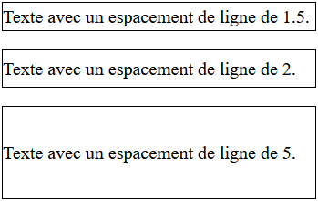

:::info Information
Une border à été ajouté afin de mieux visualiser l'espacement de ligne de chaque p.

```css
p {
    border: 1px black solid;
}
```
:::