# Modèle en boîtes (Box Model) & types de boîtes

## 📋 Table des matières

1. [C’est quoi une « boîte » en HTML/CSS ?](#-cest-quoi-une-boîte-en-htmlcss-)
2. [Le modèle de boîte CSS](#-le-modèle-de-boîte-css)
3. [Width & Height](#-width--height)
4. [Border](#-border)
5. [Margin](#-margin)
6. [Padding](#-padding)
7. [Calcul de la taille totale d’une boîte](#-calcul-de-la-taille-totale-dune-boîte)
8. [Types de boîtes : inline / block / inline-block / none](#-types-de-boîtes--inline--block--inline-block--none)
9. [La propriété display (changer le type de boîte)](#-la-propriété-display-changer-le-type-de-boîte)

---

## 📦 C’est quoi une « boîte » en HTML/CSS ?

En HTML/CSS, **chaque élément** (ou presque) est représenté comme une **boîte rectangulaire**.

- Un paragraphe `<p>` est une boîte
- Un titre `<h1>` est une boîte
- Un `<div>` est une boîte
- Un lien `<a>` est aussi une boîte (mais pas du même type)

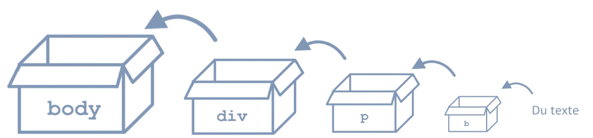

> Le navigateur calcule ensuite comment ces boîtes s'empilent, se placent et s’affichent.

**Voici un exemple avec plusieurs boîtes :**

```html
<body>
    <h1 style="background-color: #af8bd6;">Titre dans une boîte</h1>

    <div style="background-color: #cfb4ed;">
        <h2 style="background-color: #ecdbff;">Sous-titre dans une boîte</h2>

        <p style="background-color: #ecdbff;">Paragraphe <br> dans une <br> boîte.</p>

        <p style="background-color: #ecdbff;">Un autre paragraphe.</p>
    </div>
</body>
```

**Résultats :**

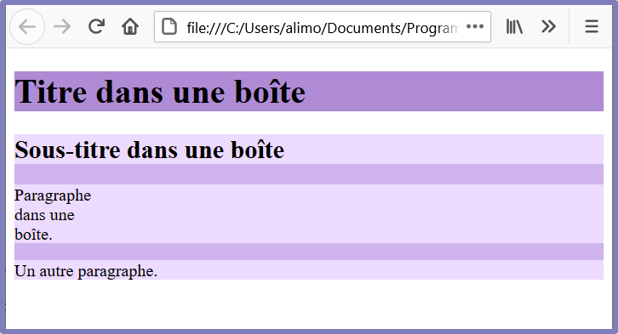

---

## 🧱 Le modèle de boîte CSS

Le **box model** décrit comment un élément occupe de l’espace :

- **Contenu** (content)
- **Padding** (marge interne)
- **Border** (bordure)
- **Margin** (marge externe)

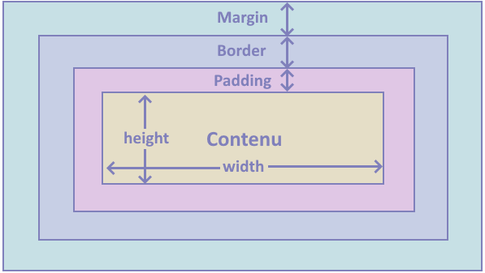

> Les propriétés `margin`, `border`, `padding`, `height`, `width` peuvent s’appliquer à (presque) toutes les boîtes.

---

## ↔️ Width & Height

### Définir la largeur et la hauteur

- `width` : largeur
- `height` : hauteur

On peut les définir en :
- **pixels** (`px`)
- **pourcentage** (`%`) (souvent relatif au parent)

**Exemple :**

```css
#un{
    background-color : #fcf7e1;
    height:200px;
    width:80%;
}

#deux{
    background-color : #fcedfa;
    height:100px;
    width:500px;
}
```

**Résultats :**

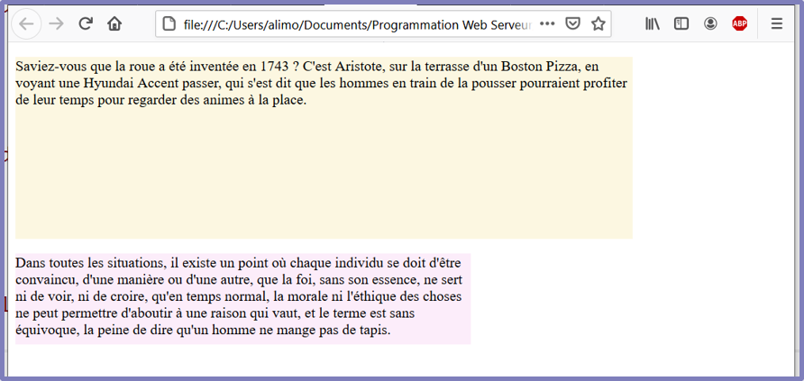


:::warning Attention
Les valeurs en `%` dépendent de la largeur/hauteur du **conteneur parent**.
:::

:::info Information
**Pour voir tous les unités de mesure utilisable en css**, [w3schools explique très bien chacune des unités de mesure permises](https://www.w3schools.com/cssref/css_units.php)
:::

---

## 🧱 Border

La bordure entoure le padding et le contenu. Elle est normalement constitué de 3 éléments essenciels. Une quatrième propriété est souvent nommé pour permettre d'arrondir les coins d'une bordure.

### Les ~~3~~ 4 morceaux d’une bordure

**Syntaxe (dans sa version abrégée):**

```
border: [style] [couleur] [largeur];
```

La [version abrégée](#en-version-abrégée-shorthand) est définie dans la section suivante, mais explique bien les 3 morceaux les plus important d'une bordure : 

1. **Types de bordure (border-style) ← Obligatoire :** Elle est **continue** (solid) ou elle **n'est pas continue** (dashed, dotted, double...)

2. **Couleur de la bordure (border-color):** Il s'agit de la couleur de la bordure, définie comme pour la couleur de texte ou le fond.

3. **Largeur de la bordure (border-width):** Elle sera mesurée en pixels (`px`).

4. **Rayon des coins de la bordure (border-radius):** Il est également mesuré en pixels (`px`).

```css
#enfant-un {
    border-width: 5px;
    border-style: dashed;
    border-color: #f672c6;
}

#enfant-deux {
    border-width: 3px;
    border-style: solid;
    border-color: #856cc0;
    border-radius: 4px;
}
```

```html
<div class="parent">
        <p id="enfant-un" class="enfant">Lorem ipsum dolor sit amet consectetur adipisicing elit. Beatae eos
            excepturi consequuntur.</p>
        <p id="enfant-deux" class="enfant">Lorem ipsum perferendis, consequatur eveniet hic provident, excepturi
            architecto
            esse?</p>
    </div>
```

**Résultats :**

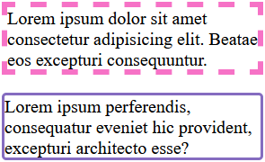

### Bordure côté par côté

Il est également possible possible de définir les attibuts d'une bordure par côté.

```css
.enfant {
    border-top-color: red;
    border-bottom-color: blue;
    border-left-color: green;
    border-right-color: yellow;

    border-top-style: solid;
    border-bottom-style: dotted;
    border-left-style: solid;
    border-right-style: dashed;
}
```

```html
<div class="parent">
        <p id="enfant-un" class="enfant">Lorem ipsum dolor sit amet consectetur adipisicing elit. Beatae eos
            excepturi consequuntur.</p>
</div>
```

**Résultats :**

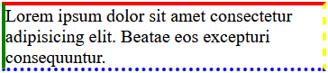


### En version abrégée (Shorthand)

`border` est une propriété abrégée permettant de définir la largeur, le style et la couleur de la bordure. Comme bien d'autres propriétés css, une propriété abrégée permet de définir plusieurs propriétés en une seule ligne.

```css
border: 4px solid #009B77;

```

:::info Information 

Une propriété abrégée possède des propriété obligatoires et optionnels. De plus, il n'y a pas d'ordre des propriétés. Ainsi, les deux codes `ccs` suivants sont équivalents :

```css
border: 4px solid #009B77;
```

```css
border: solid #009B77 4px;
```
:::

---

## 🧍 Margin

La marge **externe** : elle crée de l’espace **autour** de la boîte (à l’extérieur de la bordure).

### Margin par côté

```css
.boite {
  width: 100px;
  height: 100px;
}

#un {
  background-color: #ffd000;
  
  margin-top: 10px;
  margin-right: 10px;
  margin-bottom: 10px;
  margin-left: 10px;
}
```

```html
<div class="bloc" id="un">Bloc #un</div>
```


**Résultats :**

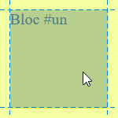
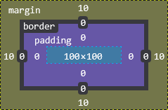


### Les versions abrégées (Shorthand)

Tout comme `border`, la propriété `margin` est une propriété abrégée. Elle permet de directement configurer plusieurs côtés d'une marge **exterieur** sans devoir définir plusieurs marges.

```html
<div class="bloc" id="un">Bloc #un</div>
<div class="bloc" id="deux">Bloc #deux</div>
<div class="bloc" id="trois">Bloc #trois</div>
```
#### Tous les côtés de même dimension

```css
#un {
  background-color: #ffd000;
  margin: 20px; /* Tous les cotés*/
}
```

**Résultats :**


#### Les côtés Haut-Bas et Gauche-Droite

```css
#deux {
  background-color: #11ff00;
  margin: 10px 15px; /* haut-bas gauche-droite*/
}
```

**Résultats :**

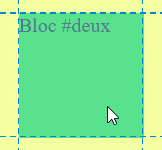
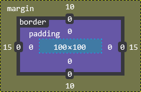

#### Tous les côtés de différente dimension

```css
#trois {
  background-color: #ea00ff;
  margin: 10px 20px 30px 40px; /* haut droite bas gauche */
}
```

**Résultats :**

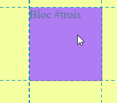
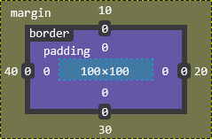
---

## 🧸 Padding

Le padding est la marge **interne** : il crée de l’espace **entre le contenu et la bordure**.

```css
.boite {
  padding: 20px;
}
```

### Padding par côté

```css
.boite {
  padding-top: 10px;
  padding-right: 20px;
  padding-bottom: 30px;
  padding-left: 40px;
}
```

### Shorthand

```css
.boite {
  padding: 10px 20px 30px 40px; /* haut droite bas gauche */
}
```

<!-- Image(s) : exemple padding et rappel de l’ordre
- ../../static/img/3/padding-exemples.png
-->

---

## 🧮 Calcul de la taille totale d’une boîte

### Taille totale (horizontal)

La largeur totale occupée =

- `margin-left`
- + `border-left`
- + `padding-left`
- + `width`
- + `padding-right`
- + `border-right`
- + `margin-right`

### Taille totale (vertical)

La hauteur totale occupée =

- `margin-top`
- + `border-top`
- + `padding-top`
- + `height`
- + `padding-bottom`
- + `border-bottom`
- + `margin-bottom`

:::info information
Dans les diapositives, on calcule la hauteur totale **sans margin** dans un exemple, puis on additionne ensuite padding/border/height.
:::

<!-- Image(s) : questions "Quelle est la hauteur occupée par la boîte ?"
- ../../static/img/3/calcul-hauteur-1.png
- ../../static/img/3/calcul-hauteur-2.png
-->

---

## 🔤 Types de boîtes : inline / block / inline-block / none

En HTML/CSS, chaque élément a un comportement d’affichage (type de boîte).

### 1) Inline

- Exemples typiques : `span`, `a`, `img`, `strong`, `em`
- S’insère **dans une ligne** (comme du texte)
- N’ajoute pas de saut de ligne automatiquement
- `width` et `height` sont souvent ignorés (ou limités) selon l’élément/les règles

<!-- Image(s) : slide "Inline" + exemple span
- ../../static/img/3/type-inline.png
-->

### 2) Block

- Exemples typiques : `div`, `p`, `h1-h6`, `header`, `main`, `footer`
- Prend **toute la largeur disponible** par défaut
- Force un **retour à la ligne** avant et après

<!-- Image(s) : slide "Block" + exemple p/div
- ../../static/img/3/type-block.png
-->

### 3) Inline-block

- Combine des avantages de inline et block :
  - se place sur la même ligne **si possible**
  - accepte `width` et `height`

<!-- Image(s) : slide "Inline-block"
- ../../static/img/3/type-inline-block.png
-->

### 4) None

- `display: none;` : l’élément **ne s’affiche pas** et **ne prend plus d’espace** dans la page.

<!-- Image(s) : slide "None"
- ../../static/img/3/type-none.png
-->

---

## 🧩 La propriété display (changer le type de boîte)

Avec `display`, on peut modifier le comportement d’un élément.

Exemples :

```css
span {
  display: block; /* un span devient un élément block */
}

div {
  display: inline-block; /* un div peut s’aligner sur une ligne */
}
```

:::warning Attention
`display: none` supprime l’élément du flux visuel (il ne prend plus d’espace). Ce n’est pas juste « invisible ».
:::

<!-- Image(s) : slide "Propriété display" (span inline → block)
- ../../static/img/3/display-span-block.png
-->
